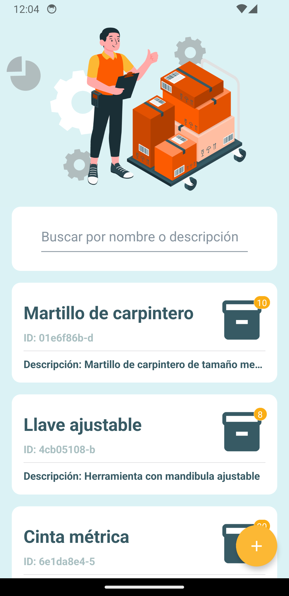
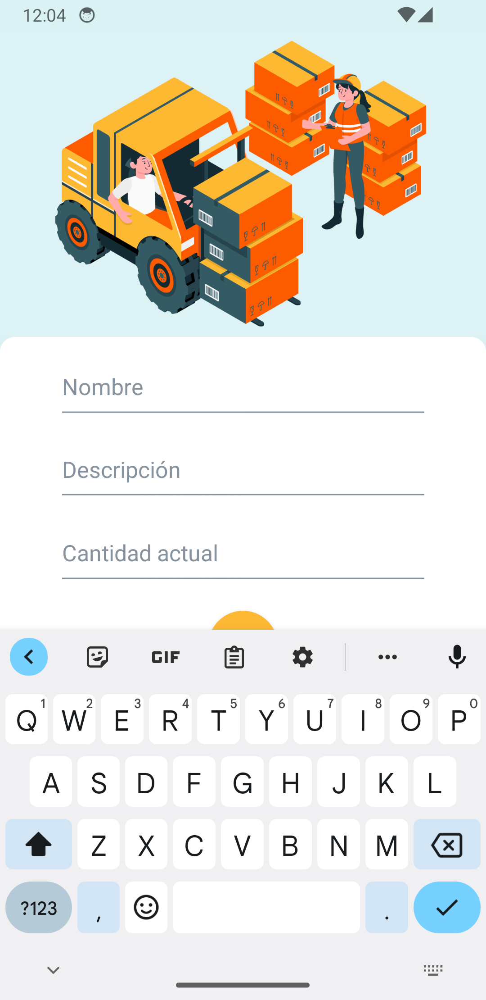
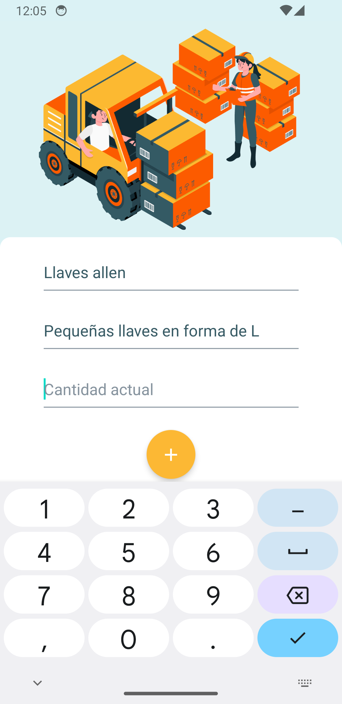

# Stock App with React Native Template App :mobile_phone_off:

Aplicación para la gestión y control de insumos, maquinas y herramientas en entornos formativos.

|  |  |  |
| ------------------------------------------------------------ | ------------------------------------------------------------ | ------------------------------------------------------------ |

## Entorno

### Git

Asegurarse de tener instalado `git` . Esto se puede revisar muy facilmente a trevez del comando `git --version` . En caso de no estar instalado, se puede hacer a travez de los siguientes paso

- En linux, a travez del comando `sudo apt install git`.
- En Windows, a travez de la pagina oficial https://git-scm.com/

### NodeJS

Procurar tener actualizado `node.js` a la versión lts. Para saber si Node.js esta instalado en su sistema, abra una terminal y ejecute el siguiente comando `npm doctor`. El resultado debe ser la versión de `node ` y `npm`instalada. Si el comando no se encuentra o no se encuentran actualizados, se puede instalar `Node.js` mediante alguno de los siguientes pasos

- En windows, desde la [pagina oficial](https://nodejs.org/en/), descargando y ejecutando la versión `lts`.

- En Linux, a través de `nvm`.

  - Abrir una terminal y ejecutar alguno de los siguientes comando

    ```bash
    curl -o- [https://raw.githubusercontent.com/nvm-sh/nvm/v0.39.1/install.sh](https://raw.githubusercontent.com/nvm-sh/nvm/v0.39.1/install.sh) | bash
    ```

    ```bash
    wget -qO- [https://raw.githubusercontent.com/nvm-sh/nvm/v0.39.1/install.sh](https://raw.githubusercontent.com/nvm-sh/nvm/v0.39.1/install.sh) | bash
    ```

  - Cerrar la terminal y abrir otra para ejecutar el siguiente comando para verificar la correcta instalación`nvm --version` . Una vez observada la versión, ejecutar el siguiente comando para instalar Node.js

    ```bash
    nvm install --lts
    ```

### Expo

Asegurarse de tener instalado `expo` . Esto se puede revisar muy fácilmente a trevez del comando `expo --version` . En caso de no estar instalado, se puede hacer a través del comando

```
npm i -g expo-cli
```

Por otra parte, para compilar el ejecutable ya sea para android o para ios, debe tener una cuenta en [expo.dev](https://expo.dev/). Para construir la aplicación, se recomienda seguir la siguiente [guia](https://docs.expo.dev/classic/building-standalone-apps/).

## Instalación y ejecución

- 🛠Para instalar las dependencias ejecutar el comando `npm install`
- ⚒Para ejecutar expo, usar el comando `npm run start`
- ⚒Para ejecutar expo en modo web, usar el comando `npm run web`
- ⚒Para ejecutar el simulador de dispositivos de android studio, usar el comando `npm run android` . Para esta opción debe tener
  - Android Stuidio
  - Un dispositivo emulador en Android Studio
  - Variables de entorno de Android Studio para Expo configuradas
- ⚒Para ejecutar expo el simulador de dispositivos de IOS, usar el comando `npm run ios`. 

## Características

- [TypeScript](https://www.typescriptlang.org/)
- [React Native](https://reactnative.dev/)
- [Expo](https://expo.dev/)
- [TailwindCSS con TWRNC](https://github.com/jaredh159/tailwind-react-native-classnames)
- [Rect Native Vector Icons](https://github.com/oblador/react-native-vector-icons)
- [React Native Navigation](https://reactnavigation.org/)
- [Expo Google Fonts](https://docs.expo.dev/guides/using-custom-fonts/) (No se encuentra por defecto en el template, pero se recomienda su uso)
- [React Native Elements](https://reactnativeelements.com/)
- [React Redux and Redux Toolkit](https://redux.js.org/tutorials/quick-start)

## Pasos para customizar este template

### Favicon

Empieza eligiendo el icono o logotipo que representará a la pagina. Recomiendo https://favicon.io/ para este trabajo. Es rápido, sencillo, y nos provee de todo lo necesario para incluir el icono en la pagina. Cuando termine de crear la marca, descargue el comprimido y su contenido debe moverse a la carpeta `public` del proyecto. 

La propia pagina nos otorga los links que debemos pegar en el `Layout/components/Header` para que los iconos sean tomados en cuenta.

### Colores

Con la marca ya elegida, proceda a elegir los colores que serán parte del estilo de la pagina. En la carpeta `src/theme/Theme.tsx` se encuentra el componente a cargo de customizar la paleta de colores, ademas de otras características del estilo. Recomiendo leer los siguientes artículos para saber más.

- https://mui.com/material-ui/customization/theming/
- https://mui.com/material-ui/customization/color/
- https://reactnativeelements.com/docs/customization/themeprovider

#### pantallas o screens

En la carpeta `/screens` es donde se localizan cada una de las pantallas separadas por carpeta de acuerdo a función dentro de la app. En la carpeta `/screens/navigator` se encuentra el componente encargado de gestionar la stack de pantallas.

#### estado global

En la carpeta `/src` se encuentra la lógica para la gestión del estado del inventario. Se implemento usando `react-redux` y `redux-toolkit` por lo que saber sobre estas tecnologías es fundamental para poder extender las capacidades de este template.